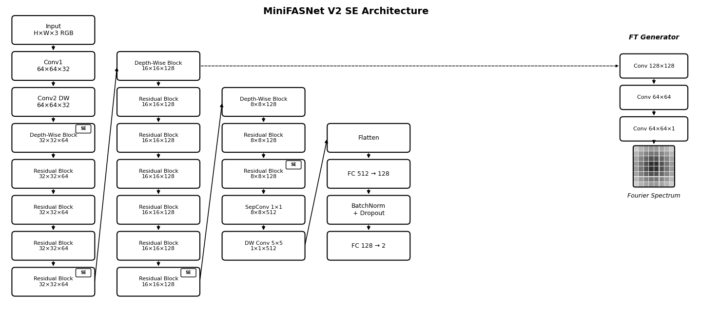

## What is this?

MiniFASNet V2 SE is a small neural network built for face anti-spoofing, not a general-purpose image classifier. The architecture was specifically designed to tell real faces apart from fakes (printed photos, phone screens, masks, that kind of thing).

Input: RGB face crop. Output: Real or Spoof prediction.

## The problem with spoofs

Detecting fake faces isn't the same as recognizing faces. The task is about finding artifacts, the weird stuff that gives away a presentation attack:

- Moiré patterns when someone holds up a phone screen
- Slight color shifts from printed photos (printers can't perfectly reproduce skin tones)
- Texture differences (paper and plastic don't look like skin up close)
- Reflections and glare from screens

The tricky part is these artifacts are subtle. A good print or high-res display can fool a naive classifier pretty easily. That's why MiniFASNet uses a few specific tricks:

1. Depthwise separable convolutions (keeps the model tiny)
2. SE blocks that let the network focus on whatever channels matter most
3. A Fourier Transform branch during training that forces the network to pay attention to frequency patterns

## How it's structured

### Early layers

Two conv layers right at the start cut the resolution in half and bump up the channels:

- Conv1: 3×3, stride 2 → 64×64×32
- Conv2 DW: depthwise 3×3 → stays at 64×64×32

Downsampling early keeps computation low for the rest of the network.

### Stage 1: 32×32×64

One depth-wise block drops resolution to 32×32, then 4 residual blocks process features at that scale. Each residual block is the usual 1×1 → 3×3 DW → 1×1 pattern. The last block has an SE module attached.

Residual connections are here for the usual reasons: helping training and letting the network skip layers that aren't needed.

### Stage 2: 16×16×128

Same idea, but 6 residual blocks instead of 4. More capacity here since 16×16 is where a lot of the texture information lives. SE block on the final residual again.

This is also where the FT Generator branch taps in during training (more on that below).

### Stage 3: 8×8×128

Down to 8×8 now. Only 2 residual blocks here since spatial resolution is small enough that more aren't needed. SE on the last one.

By this point the receptive field covers most of the input image.

### Reduction

Before the classifier head, spatial dimensions need to collapse:

- SepConv 1×1 bumps channels to 512
- DW Conv 5×5 pools everything down to 1×1×512

This ends up being cheaper than global average pooling + a big FC layer.

### Classifier head

Pretty standard stuff:

- Flatten to 512-d vector
- FC 512→128
- BatchNorm + Dropout (0.75 dropout rate, which is aggressive)
- FC 128→2 for the final Real/Spoof logits

The 0.75 dropout seems high but anti-spoofing models overfit *hard*. Training data just doesn't cover all the ways people try to spoof. Cranking up dropout helps.

## SE blocks

Squeeze-and-Excitation blocks show up at the end of each stage. The idea is simple:

1. Global average pool to get one number per channel
2. Two small FC layers produce a weight for each channel  
3. Multiply the original features by those weights

The network can learn to emphasize channels that matter for the current input. Maybe certain channels fire more on screen moiré, others on paper texture. SE lets the network figure that out.

SE blocks only appear at stage boundaries. Adding SE to every block would slow things down for not much gain.

## Fourier Transform branch

This is the interesting part. During training only, there's an auxiliary branch that takes Stage 2 features and tries to predict a Fourier spectrum.

Why bother? Spoofing artifacts often show up cleaner in frequency space:

- Screen pixels produce regular grid patterns → shows up as peaks in the spectrum
- Print halftoning has characteristic frequency signatures
- Real skin texture is more random/organic

The branch is just three conv layers (128→64→1) outputting a single-channel prediction, supervised against actual FFTs of the input. Gradients flow back into the backbone, so the whole network learns to pick up on frequency patterns.

At inference time, this branch gets removed entirely since the job was done during training.

## Numbers

Rough parameter breakdown:

| Part | Params |
|:-----|:-------|
| Conv1 + Conv2 | ~3K |
| Stage 1 | ~150K |
| Stage 2 | ~500K |
| Stage 3 | ~250K |
| Reduction | ~300K |
| Head | ~70K |
| FT branch | ~500K (training only) |

Total is around 1.8M params. After quantizing to INT8, the deployed ONNX model comes out to about 600 KB.

## Why not MobileNetV4?

MobileNetV4 was actually tried first. It worked fine, but:

| | MobileNetV4 | MiniFASNet |
|:--|:------------|:-----------|
| Size | ~3.5 MB | ~1.8 MB |
| Purpose | General classification | Anti-spoofing |
| FT supervision | Bolted on | Native |
| Training | Fiddly (pretrained weights, LR schedules) | Straightforward |

Accuracy was about the same, so the smaller, simpler option won. MobileNetV4 code is still in `src/mobilenetv4/` for anyone wanting to experiment.

## References

- [Silent-Face-Anti-Spoofing](https://github.com/minivision-ai/Silent-Face-Anti-Spoofing) - where MiniFASNet comes from
- [Squeeze-and-Excitation Networks](https://arxiv.org/abs/1709.01507)
- [Learning Deep Models for Face Anti-Spoofing](https://arxiv.org/abs/1809.00338) - the Fourier supervision idea
